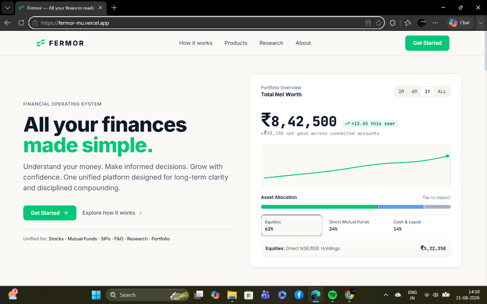
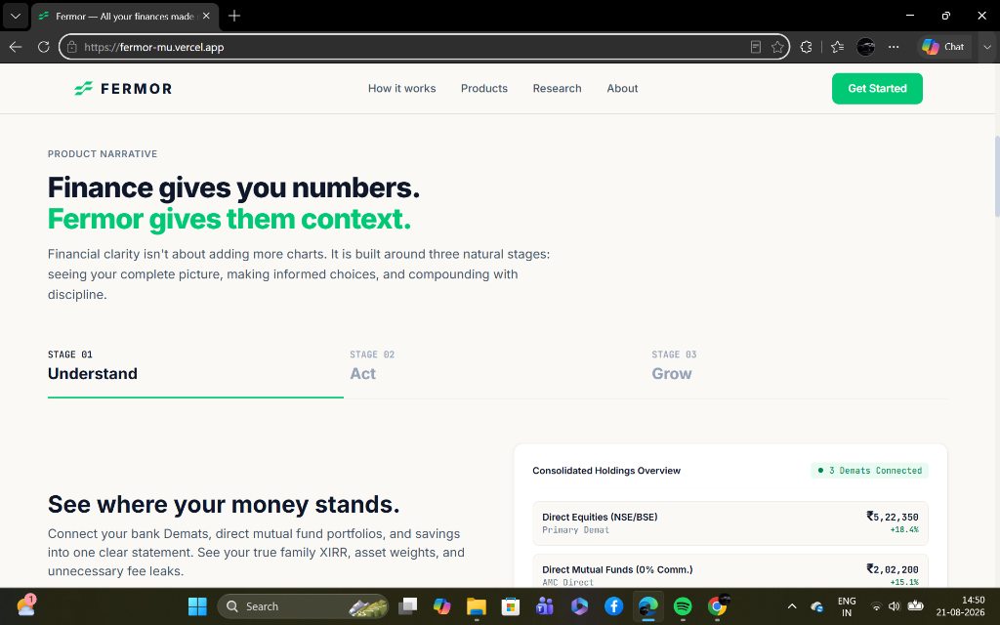
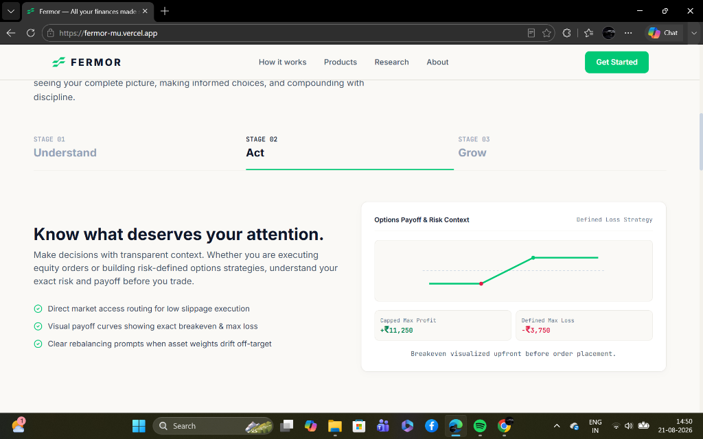
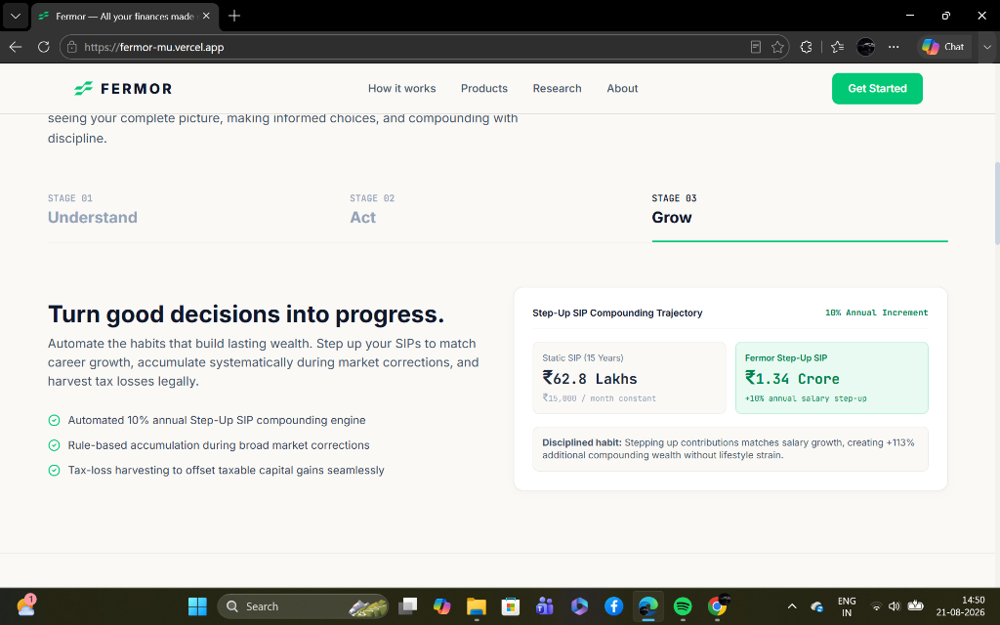
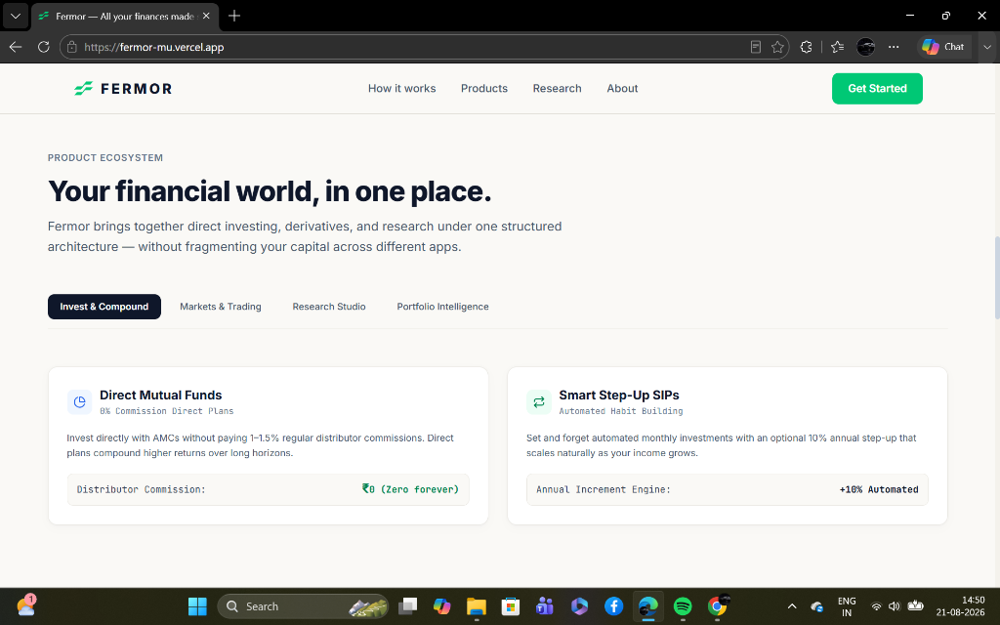

# 🌿 FERMOR — Financial Operating System

> **"All your finances made simple. Understand. Act. Grow."**

[](https://nextjs.org/)
[](https://reactjs.org/)
[](https://www.typescriptlang.org/)
[](https://tailwindcss.com/)
[](https://www.framer.com/motion/)
[](https://fermor-mu.vercel.app)

FERMOR is a unified financial operating system designed for modern Indian investors. It brings together direct equity holdings, zero-commission mutual funds, step-up SIPs, derivatives risk modeling, and portfolio intelligence into a clean, disciplined interface.

- 🌐 **Live Demo:** [https://fermor-mu.vercel.app](https://fermor-mu.vercel.app)
- 📦 **GitHub Repository:** [https://github.com/Mohityadav55199/Fermor](https://github.com/Mohityadav55199/Fermor)

---

## 📸 Product Showcase & Screenshots

### 1. Hero & Consolidated Portfolio Overview
Asymmetrical hero dashboard featuring live net worth tracking, dynamic asset allocation visualizer (Equities, Direct Mutual Funds, Cash/Liquid), and real-time gain metrics.



---

### 2. Stage 01: Understand — Unified Holdings & Fee Leak Scanner
Connect multiple bank Demats and AMC portfolios to uncover true family XIRR, asset weights, and unnecessary distributor fee leaks.



---

### 3. Stage 02: Act — Defined-Risk Options Payoff Visualizer
Execute equity orders and risk-defined options strategies with complete upfront clarity on breakeven points, capped max profit, and defined max loss before placing trades.



---

### 4. Stage 03: Grow — 10% Step-Up SIP Compounding Engine
Automate wealth-building habits with smart salary step-up SIPs (+113% additional compounding wealth vs static contributions) and rule-based accumulation during market dips.



---

### 5. Product Ecosystem — Structured Bento Architecture
A centralized ecosystem across Direct Mutual Funds (0% commission forever), Smart Step-Up SIPs, Markets & Trading, Research Studio, and Portfolio Intelligence.



---

## ✨ Key Features & Architecture

| Feature | Description |
| :--- | :--- |
| **Unified Net Worth View** | Consolidated tracking across multi-broker Demats (NSE/BSE), AMC Direct mutual funds, and liquid cash. |
| **The 3-Stage Journey** | Structured narrative guiding users through **Understand** (portfolio health), **Act** (informed execution), and **Grow** (compounding). |
| **Visual Payoff Curves** | Real-time interactive options strategy curves displaying exact breakeven lines and risk boundaries upfront. |
| **Step-Up SIP Simulator** | Compares static ₹15,000/mo investments (₹62.8L) with 10% annual step-up compounding (₹1.34 Cr over 15 years). |
| **0% Commission Direct MFs** | Direct AMC integration eliminating 1–1.5% recurring distributor commissions. |
| **Command Palette & Keyboard First** | Quick navigation and action execution via keyboard shortcuts (`Cmd/Ctrl + K`). |
| **Indian Financial Localization** | Built natively for Indian capital markets (`₹` INR currency, Nifty 50, ELSS 80C, EPF, NSE/BSE). |

---

## 🛠️ Tech Stack & Libraries

- **Framework:** [Next.js 14](https://nextjs.org/) (App Router, Server Components & Client Boundaries)
- **Language:** [TypeScript 5](https://www.typescriptlang.org/)
- **UI & Styling:** [Tailwind CSS 3.4](https://tailwindcss.com/) with custom Fermor Design Tokens
- **Icons:** [Lucide React](https://lucide.dev/)
- **Animations:** [Framer Motion 13](https://www.framer.com/motion/) + CSS keyframe animations (ticker, pulse, shimmer)
- **Delight Effects:** [Canvas Confetti](https://www.npmjs.com/package/canvas-confetti)
- **Deployment:** [Vercel](https://vercel.com/)

---

## 🚀 Getting Started & Setup Instructions

### Prerequisites

Ensure you have the following installed on your local machine:
- **Node.js:** `v18.17.0` or higher (Node 20+ recommended)
- **Package Manager:** `npm` (v9+), `yarn`, or `pnpm`
- **Git**

### Installation

1. **Clone the repository:**
   ```bash
   git clone https://github.com/Mohityadav55199/Fermor.git
   cd Fermor/fermor-homepage
   ```
   *(Or `cd Fermor` if running from the root repository)*

2. **Install dependencies:**
   ```bash
   npm install
   ```

3. **Start the local development server:**
   ```bash
   npm run dev
   ```

4. **Open in browser:**
   Navigate to [http://localhost:3000](http://localhost:3000) to view the application.

---

## 📜 Available Scripts

In the project directory, you can run:

| Command | Description |
| :--- | :--- |
| `npm run dev` | Runs the app in development mode with Hot Module Replacement at `http://localhost:3000` |
| `npm run build` | Compiles and builds the production-ready Next.js application |
| `npm run start` | Starts the production server after building |
| `npm run lint` | Runs ESLint to inspect code for syntax and style issues |

---

## 📂 Project Structure

```
fermor-homepage/
├── public/                     # Static assets & brand media
│   ├── favicon.svg             # Official Fermor geometric mark
│   ├── fermor-mark.png         # High-resolution raster brand mark
│   └── screenshots/            # Product showcase screenshots
│       ├── 01-hero-portfolio.png
│       ├── 02-stage-understand.png
│       ├── 03-stage-act.png
│       ├── 04-stage-grow.png
│       └── 05-product-ecosystem.png
├── src/
│   ├── app/
│   │   ├── layout.tsx          # Root HTML layout, font definitions & metadata
│   │   ├── page.tsx            # Main homepage composition
│   │   └── globals.css         # Global Tailwind styles & font tokens
│   ├── components/
│   │   ├── navbar/             # Sticky glass navbar with live ticker
│   │   ├── hero/               # Asymmetrical hero + interactive portfolio card
│   │   ├── story/              # 3-Stage Timeline (Understand -> Act -> Grow)
│   │   ├── products/           # Asymmetrical Bento Ecosystem Grid
│   │   ├── clarity/            # Financial Decision Simulator
│   │   ├── philosophy/         # Trust & transparency pillars
│   │   ├── cta/                # Early access onboarding modal & final banner
│   │   └── footer/             # Professional footer with legal disclaimers
│   └── lib/                    # Formatting helpers (INR formatters, calculations)
├── screenshots/                # Root documentation screenshots
├── tailwind.config.ts          # Custom Fermor color tokens & custom animations
├── tsconfig.json               # TypeScript compiler configuration
└── package.json                # Project dependencies and npm scripts
```

---

## 🎨 Design System & Visual Philosophy

- **Canvas & Tone:** Editorial warm off-white canvas (`#FAF9F6`) paired with deep slate typography (`#0F172A`) for effortless legibility.
- **Brand Accent:** Authentic Fermor Emerald (`#00C875` / `fermor-500`) used purposefully for primary actions, compounding gains, and high-signal indicators.
- **Typography:** 
  - Text & Headers: `Inter` for clean readability across desktop and mobile.
  - Financial Data: `JetBrains Mono` with tabular numbers (`.tnum`) to eliminate layout jitter during live value changes.
- **Micro-Interactions:** Smooth Framer Motion stage transitions, interactive asset allocation tooltips, and tabbed payoff curves.

---

## 🚢 Deployment

The project is configured for continuous deployment on **Vercel**:

1. Push code to `main` branch on GitHub.
2. Vercel automatically detects Next.js, installs dependencies, runs `npm run build`, and deploys to the global edge network.
3. **Live URL:** [https://fermor-mu.vercel.app](https://fermor-mu.vercel.app)

---

## 👤 Author

- **Mohit Yadav**
- **GitHub:** [@Mohityadav55199](https://github.com/Mohityadav55199)
- **Project:** FERMOR Frontend Developer Evaluation
